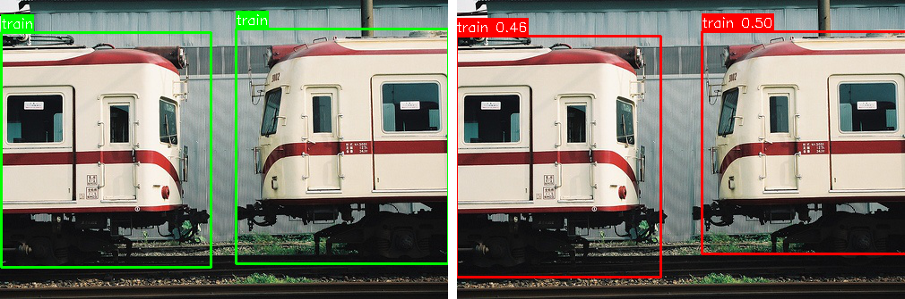
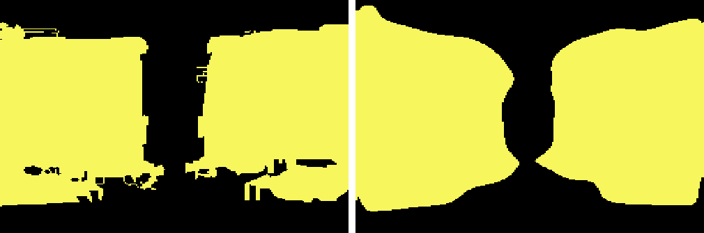
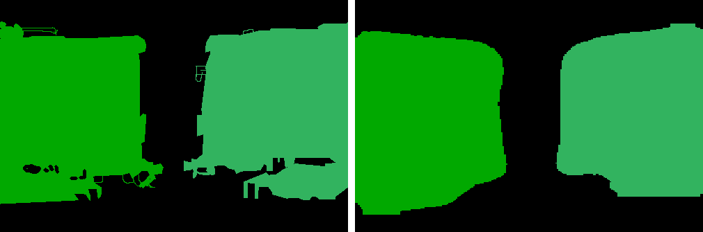

# Pascal_TriheadNet

**Single-stage unified perception model for Pascal VOC: Detection, Semantic, and Instance Segmentation in one forward pass.**

A unified codebase for joint Object Detection (FCOS), Semantic Segmentation (Panoptic FPN), and Instance Segmentation (Mask R-CNN style) on the Pascal VOC dataset, powered by a ViT backbone.

## 🚀 Key Features
- **Joint Architecture**: Single ViT backbone with a **Simple Feature Pyramid (ViTDet)** neck feeding into three specialized heads.
- **Task-Unified Data Loading**: Custom `PascalUnifiedDataset` handles Detection (XML), Semantic (PNG), and Instance (PNG) annotations simultaneously.
- **Efficient Evaluation**: Batched inference for instance segmentation and per-class metric reporting.
## 📁 Dataset Structure
The code expects the standard Pascal VOC directory structure. 

## 🎨 Visual Results

Below are examples of the model's unified output (Detection + Semantic + Instance):





**Video Demos:**
- 🎥 [Bottle_Detection](outputs/Video_demos/vis_bottle-detection.mp4)


```
VOC2012/
├── JPEGImages/        # .jpg images
├── Annotations/       # .xml detection annotations
├── SegmentationClass/ # .png semantic masks (class ID encoded in pixel value)
├── SegmentationObject/# .png instance masks (instance ID encoded)
└── ImageSets/
    ├── Main/          # train.txt, val.txt for detection
    └── Segmentation/  # train.txt, val.txt for segmentation
```

**Note**: For training, `trainval.txt` is utilized with a hash-based 80/20 split to maximize data usage while maintaining a consistent validation set.


## 📥 Model Checkpoints

Provided are pretrained models hosted on **Hugging Face**. You can download them to run inference directly.

🔗 **[Download Models from Hugging Face 🤗](https://huggingface.co/Sivamorgan/pascal-triheadnet/tree/main)**

| Model | Description | Size |
| :--- | :--- | :--- |
| **`checkpoint_epoch_50.pth`** | Best performing FP32 model (Epoch 50).|826MB
| **`checkpoint_epoch_50_quantized.pth`** | INT8 Quantized model (Linear & Conv2d).|136MB

> [!CAUTION]
> **Quantized Models**: If you are using the quantized checkpoint, ensure you are loading it correctly. The scripts (`infer_single.py`, `evaluate.py`) automatically detect "quantized" in the filename and apply the necessary dynamic quantization structure **before** loading weights. If you rename the file, automatic detection might fail.

## 🛠 Installation

```bash
pip install -r requirements.txt
```

## 🛠 Usage

### 1. Training (Joint)
Train all three tasks simultaneously.

```bash
# Using Hydra for flexible configuration
!python scripts/train_joint.py \
    data.batch_size=32 \
    training.num_epochs=50 \
    wandb.enabled=true \
    data.root="/path/to/VOC2012"
```

> **Note**: This model was trained on an **L4 GPU** in Google Colab for approximately **4 hours**. The last 6 layers of the backbone were unfrozen and fine-tuned with the weights specified in `configs/joint_training.yaml`.

### 2. Evaluation
Evaluate on the validation set. Support per-class metrics.

```bash
python scripts/evaluate.py \
    data.root="/path/to/VOC2012" \
    split='val' \
    training.resume="checkpoints/joint_training/best_model.pth" \
    class_metrics=true
```

### 3. Inference
Run the model on custom data.

**Image Inference:**
```bash
python scripts/infer_single.py \
    --image_path assets/my_image.jpg \
    --checkpoint_path checkpoints/joint_training/best_model.pth \
    --output_path output.jpg
```

**Video Inference:**
```bash
python scripts/infer_video.py \
    --video_path assets/my_video.mp4 \
    --checkpoint_path checkpoints/joint_training/best_model.pth \
    --output_path output_video.mp4
```

**Note for CPU Users**: If running on CPU, use `batch_size=1` and `num_workers=0` to avoid OOM errors.


## 🏗 Architecture
See [REPORT.md](REPORT.md) for a detailed breakdown of the model components and performance metrics.


## 📦 Project Structure

```
det_seg/
├── assets/              # Images/Videos for readme and testing
├── configs/             # Hydra .yaml configs
├── data/                # Dataset loading and transforms
│   └── Dataset.py       # PascalUnifiedDataset
├── losses/              # Loss functions (Joint, Detection, Segmentation)
├── models/              # Network architecture
│   ├── backbone.py      # ViT Backbones
│   ├── neck.py          # Feature Pyramid Network (FPN)
│   ├── head.py          # Detection, Semantic, Instance Heads
│   └── architectures.py # JointModel wrapper
├── scripts/             # Entry points
│   ├── train_joint.py
│   ├── evaluate.py
│   ├── infer_single.py
│   └── infer_video.py
├── utils/               # Helpers (metrics, visualization, post-processing)
├── REPORT.md            # Technical Report
├── requirements.txt
└── README.md
```

## 🙌 Acknowledgements
This project was developed with the assistance of **Google Antigravity**, an agentic AI coding assistant.
