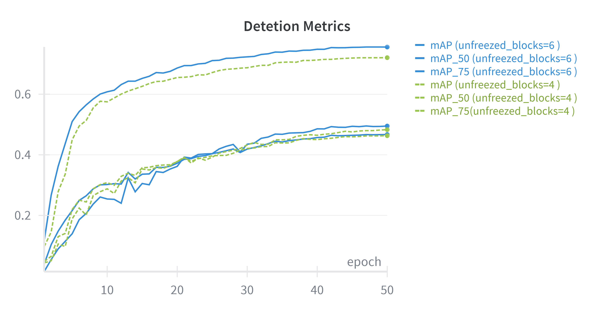
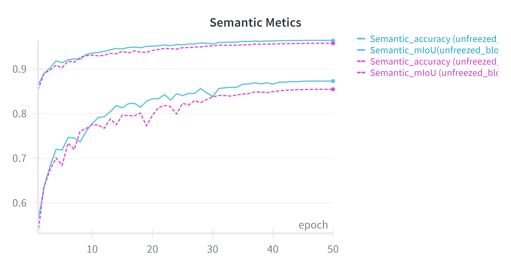
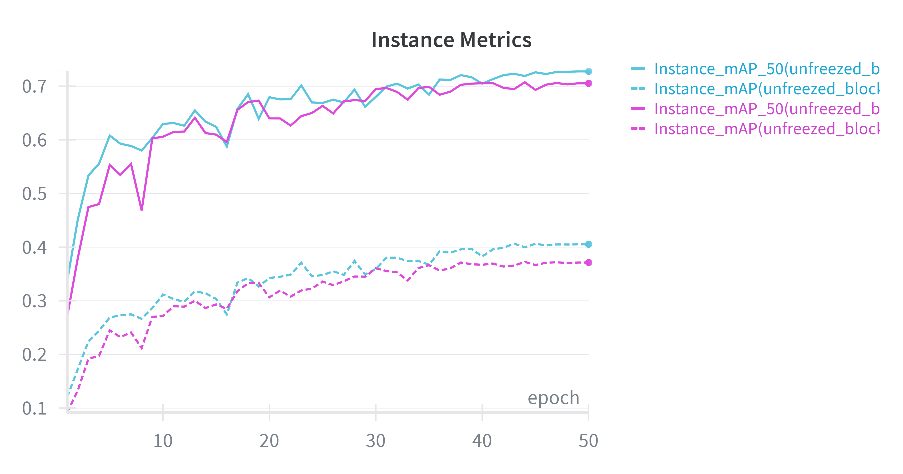

# Pascal-TriheadNet: Joint Detection & Segmentation

## 1. Architecture Overview

 The model follows a **One Backbone, One Neck, Three Heads** design to jointly solve three tasks:
 1.  **Object Detection** (Bounding Boxes & Classes)
 2.  **Semantic Segmentation** (Pixel-wise Classification)
 3.  **Instance Segmentation** (Pixel-wise Masks per Object)

### Backbone: Vision Transformer (ViT)
-   **Encoder**: We use a `vit_base_patch16_224` pretrained on ImageNet.
-   **Input**: 224x224 RGB images.
-   **Output Features**: The ViT produces a single-scale feature map (1/16 resolution) from the final transformer block. The Neck is responsible for generating the multi-scale pyramid from this single input.

### Neck: Simple Feature Pyramid (ViTDet Style)
-   **Architecture**: Unlike a traditional FPN that uses top-down pathways, we use a **Simple Feature Pyramid** tailored for plain Vision Transformers.
-   **Mechanism**: The single-scale output from the ViT (at 1/16 resolution) is upsampled or strided in parallel to create the pyramid.
-   **Parallel Scales**:
    -   `P2` (1/4 resolution): 4x Bilinear Upsample + Conv
    -   `P3` (1/8 resolution): 2x Bilinear Upsample + Conv
    -   `P4` (1/16 resolution): Conv (Base scale)
    -   `P5` (1/32 resolution): 2x Stride Conv

### Heads

#### A. Detection Head (FCOS-style)
-   **Type**: Anchor-free, one-stage detector.
-   **Inputs**: P2, P3, P4, P5
-   **Outputs per level**:
    1.  **Classification**: `(N, 20, H, W)` logits (Sigmoid focal loss).
    2.  **Regression**: `(N, 4, H, W)` box offsets (LTRB format, GIoU loss).
    3.  **Centerness**: `(N, 1, H, W)` quality score (BCE loss).

#### B. Semantic Segmentation Head (Panoptic FPN style)
-   **Mechanism**: Merges all FPN levels (`P2` to `P5`) into a single high-resolution feature map.
-   **Upsampling**:
    -   `P5` (1/32) captures global context.
    -   Upsamples recursively to match `P2` (1/4).
    -   Element-wise sum fuses multi-scale features.
    -   Final 4x upsample restores native 224x224 resolution.
-   **Output**: `(N, 21, 224, 224)` (20 classes + background).

#### C. Instance Segmentation Head (Mask R-CNN style)
-   **Dependency**: Requires detection boxes (from Ground Truth during training, or Detection Head during inference).
-   **RoI Align**: Extracts features for each candidate box from the most appropriate FPN level (`P2`-`P5`) based on box scale.
-   **Mask Branch**: A small FCN predicts a 28x28 binary mask for each box.
-   **Inference**:
    1.  Get boxes from Detection Head.
    2.  Extract 14x14 features via RoI Align.
    3.  Predict 28x28 masks.
    4.  Paste masks back into the image based on box coordinates.

## 2. Training Strategy

### Loss Function
The total loss is a weighted sum:
$$ L_{total} = \lambda_{det} L_{det} + \lambda_{sem} L_{sem} + \lambda_{inst} L_{inst} $$

-   **Detection**: Focal Loss (Class) + GIoU Loss (Box) + BCE (Centerness). Weight: **1.0**.
-   **Semantic**: Cross Entropy Loss + **Dice Loss**. Weight: **1.0** (with Boundary Weight **2.0**).
-   **Instance**: Binary Cross Entropy Loss + **Dice Loss**. Weight: **1.0**.

### Hyperparameters
-   **Batch Size**: 32
-   **Learning Rate**: 2e-4 (with 0.01x multiplier for backbone)
-   **Segmentation Ratio**: 0.15 (Percent of batch with mask annotations per Batch)

### Data Augmentation
We utilize **`torchvision.transforms.v2`** to build a robust augmentation pipeline. This modern API automatically ensures geometric consistency across all inputs (Image, Bounding Boxes, and Segmentation Masks) simultaneously. Please refer to `data/Dataset.py` for the implementation details.

## 3. Performance Metrics

To ensure robust evaluation, we track:

-   **mAP (Mean Average Precision)**: Standard VOC metric (averaged over IoU 0.5:0.95).
-   **mAP @ 0.5 / 0.75**: Precision at strict IoU thresholds.
-   **mIoU (Mean Intersection over Union)**: Primary metric for semantic segmentation.
-   **Pixel Accuracy**: Percentage of correctly classified pixels.
-   **Mask mAP**: Instance segmentation accuracy (averaged over IoU 0.5:0.95).
-   **Mask mAP @ 0.5**: Instance segmentation accuracy at strict 0.5 IoU.

-   **Fine-tuning**: We **unfreeze the last 6 transformer blocks** of the backbone to adapt the features to the Pascal VOC domain while keeping early layers frozen.

## 4. Experimental Results

### Quantitative Metrics
*Results on Pascal VOC 2012 Val set (Fine-tuned)*

| Metric | Score | Description |
| :--- | :--- | :--- |
| **mAP** | **46.7%** | Detection (IoU 0.5:0.95) |
| **mAP @ 0.5** | **75.6%** | Detection (Standard Pascal) |
| **mAP @ 0.75** | **49.5%** | Detection (Strict) |
| **mIoU** | **87.3%** | Semantic Segmentation |
| **Pixel Acc** | **96.4%** | Semantic Accuracy |
| **Mask mAP** | **35.8%** | Instance Seg (IoU 0.5:0.95) |
| **Mask mAP @ 0.5** | **65.7%** | Instance Seg (Standard) |

### Per-Class Analysis (Validation Set)

| Class | Detection AP | Instance Mask AP |
| :--- | :---: | :---: |
| **Aeroplane** | 55.4% | 38.6% |
| **Bicycle** | 51.0% | 0.02% |
| **Bird** | 47.1% | 44.1% |
| **Boat** | 37.0% | 27.0% |
| **Bottle** | 25.6% | 27.8% |
| **Bus** | 62.0% | 56.1% |
| **Car** | 37.4% | 30.3% |
| **Cat** | 67.4% | 66.1% |
| **Chair** | 25.9% | 5.5% |
| **Cow** | 48.3% | 38.5% |
| **Dining Table** | 42.5% | 29.7% |
| **Dog** | 64.3% | 60.6% |
| **Horse** | 58.2% | 33.1% |
| **Motorbike** | 53.3% | 34.5% |
| **Person** | 40.9% | 25.6% |
| **Potted Plant** | 23.2% | 13.5% |
| **Sheep** | 43.1% | 33.2% |
| **Sofa** | 41.7% | 43.1% |
| **Train** | 61.0% | 60.9% |
| **TV Monitor** | 48.2% | 48.5% |

### Ablation Study: Fine-Tuning Depth
We compared the performance when unfreezing the last **4 layers** vs. **6 layers** of the ViT backbone. As shown below, unfreezing more layers (6) allows the model to better adapt to the specific geometry and semantics of Pascal VOC.

| Detection | Semantic | Instance |
| :---: | :---: | :---: |
|  |  |  |
*Figure: Performance comparison between unfreezing 4 vs 6 layers.*

> **Note**: Results for the **frozen backbone** baseline (0 layers unfrozen) are not reported here, as the detection metrics were significantly lower and instance segmentation metrics were not logged during those runs.

## 5. References

1.  **Panoptic FPN**: Kirillov, A., et al. "Panoptic Feature Pyramid Networks." CVPR 2019. [[PDF]](https://openaccess.thecvf.com/content_CVPR_2019/papers/Kirillov_Panoptic_Feature_Pyramid_Networks_CVPR_2019_paper.pdf)
2.  **ViTDet**: Li, Y., et al. "Exploring Plain Vision Transformer Backbones for Object Detection." ECCV 2022. [[PDF]](https://arxiv.org/pdf/2203.16527)
3.  **FCOS**: Tian, Z., et al. "FCOS: Fully Convolutional One-Stage Object Detection." ICCV 2019. [[PDF]](https://arxiv.org/abs/1904.01355)
4.  **Mask R-CNN**: He, K., et al. "Mask R-CNN." ICCV 2017. [[PDF]](https://arxiv.org/abs/1703.06870)
